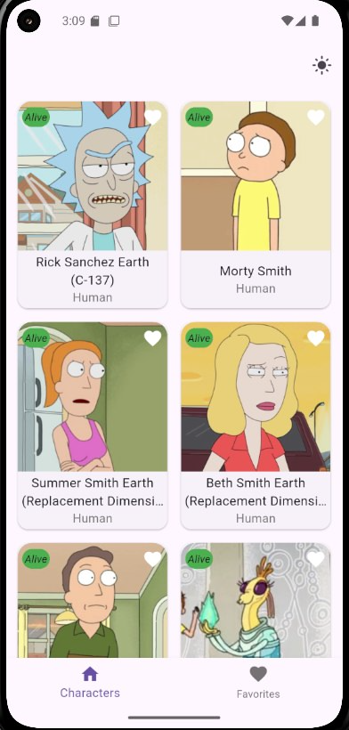
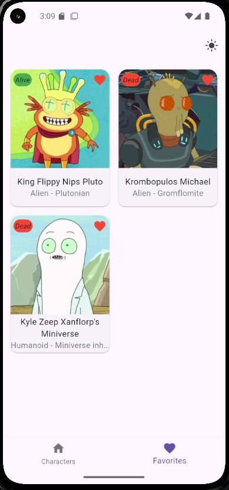

# rick_and_morty_character_info

## Видео-обзор

https://www.youtube.com/watch?v=_q0ayVSYLlY

## Скриншоты:




## Краткое описание проекта

Данный проект это мобильное приложение на Flutter для просмотра персонажей мультсериала "Рик и Морти" с возможностью добавления в избранное и оффлайн-доступом.

Проект структурирован по фичам (feature-first), используется MVVM-подход с репозиториями и ViewModel для работы с данными.

### Ключевые особенности:

- Список персонажей с пагинацией и детальной информацией
- Система избранного с локальным сохранением
- Поддержка темной темы
- Оффлайн-режим с кешированием данных

### Технический стек:

    - Flutter version: ^3.35.0
    - State Management: Provider
    - Локальная БД + cache: SharedPreferences
    - Сетевые запросы: Dio

## 🛠 Инструкция по запуску

### 1. Клонирование репозитория

```bash
git clone https://github.com/<твой-username>/rick_and_morty_character_info.git
cd rick_and_morty_character_info
```

### 2. Установка зависимостей

```bash
flutter pub get
```

### 3. Запуск на эмуляторе или устройстве

```bash
flutter run
```
